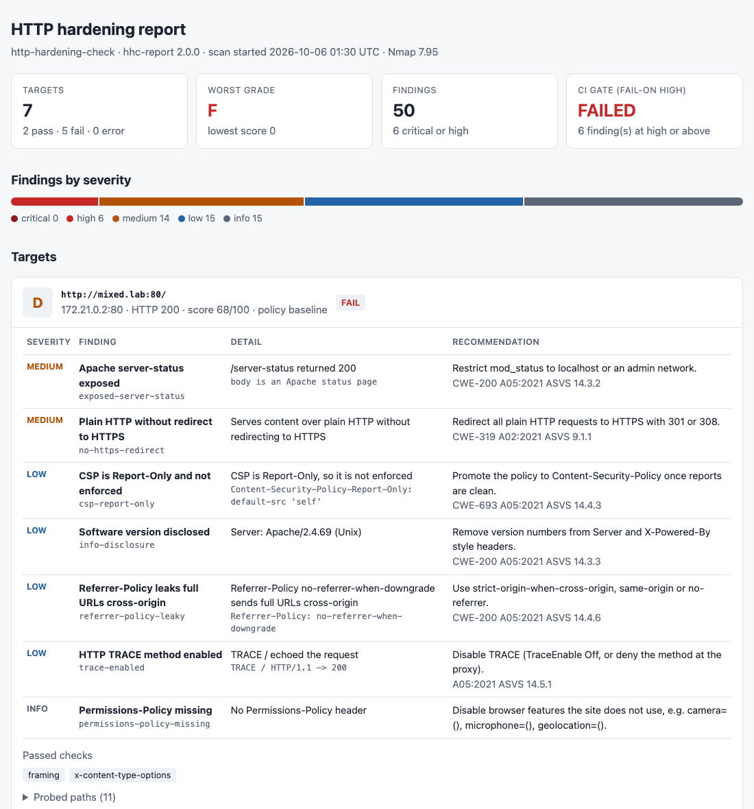
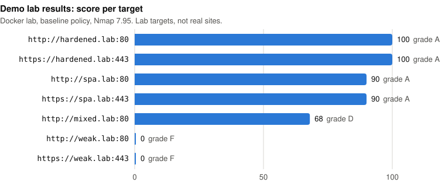
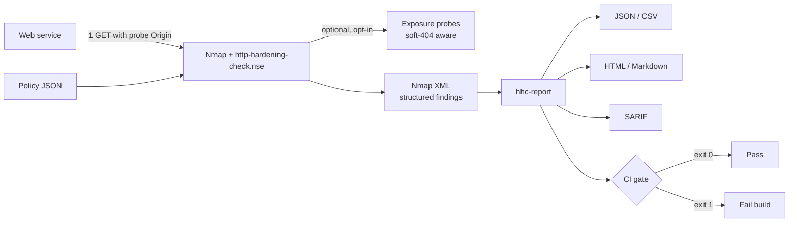

<h1> http-hardening-check</h1>

Policy-driven HTTP hardening auditor for Nmap: it validates security headers, cookies and CORS against a policy, scores each service, and produces JSON, CSV, HTML and SARIF reports that can gate a CI/CD pipeline.

[](https://github.com/VijaysinghPuwar/http-hardening-nmap-nse/actions/workflows/ci.yml)
[](https://github.com/VijaysinghPuwar/http-hardening-nmap-nse/tags)


[](LICENSE)

<picture>
  <source media="(prefers-color-scheme: dark)" srcset="docs/img/report-dark.png">
  
</picture>

<sub>HTML report rendered by `hhc-report` from the Docker demo lab (intentionally weak lab targets).</sub>

## Why this exists

Missing or weak security headers are one of the most common findings in web assessments ([OWASP Top 10 A05:2021](https://owasp.org/Top10/A05_2021-Security_Misconfiguration/)), and they are easy to regress: one proxy change and HSTS or CSP silently disappears. Checking them by hand does not scale past a few hosts.

Nmap already ships `http-security-headers`, which **lists** the headers it finds. This project **evaluates** them:

| | `http-security-headers` (bundled) | `http-hardening-check` |
|---|---|---|
| Output | Header names and values | Findings with severity, evidence, fix and CWE/OWASP/ASVS reference |
| `HSTS: max-age=0` | Listed as present | `hsts-disabled` (MEDIUM): HSTS is switched off |
| CSP with `'unsafe-inline'` | Listed as present | `csp-unsafe-inline` (MEDIUM), unless a nonce or hash neutralises it |
| HSTS on plain HTTP | Listed | Not required (browsers ignore it); the missing redirect is the finding |
| Clickjacking | X-Frame-Options shown | CSP `frame-ancestors` and X-Frame-Options judged together, as browsers do |
| Policy, score, CI exit code | No | Policy files, 0-100 score and grade, `hhc-report --fail-on` |
| Regression tracking | No | `--baseline`: only new findings fail the build |

## Quickstart

Everything runs locally against intentionally insecure containers on an isolated Docker network. You need Docker and `make`.

```bash
git clone https://github.com/VijaysinghPuwar/http-hardening-nmap-nse.git
cd http-hardening-nmap-nse
make demo        # build the lab, scan it, write reports to lab/docker/out/
open lab/docker/out/report.html   # or xdg-open
make lab-down
```

With Nmap installed, scan a system you are authorized to test directly:

```bash
nmap -sV -p80,443 --script ./http-hardening-check.nse app.internal.example
nmap -sV -p443 --script ./http-hardening-check.nse \
  --script-args 'http-hardening-check.policy=policies/strict.json,http-hardening-check.vhost=app.internal.example' \
  -oX scan.xml 10.0.0.15
```

## Example result

Real output from the demo lab's `weak.lab` (nginx 1.27, Nmap 7.95):

```
443/tcp open  ssl/http nginx
| http-hardening-check:
|   url: https://weak.lab:443/ (200)
|   result: FAIL  score: 17/100  grade: F  policy: baseline
|   summary: critical=0 high=1 medium=4 low=6 info=6 (fail-on=medium)
|   HIGH     cors-reflected-credentials  Origin reflected in Access-Control-Allow-Origin with credentials allowed
|   MEDIUM   cookie-no-secure            Session cookie sent without Secure over HTTPS: PHPSESSID
|   MEDIUM   csp-broad-script-source     default-src allows scripts from *
|   MEDIUM   csp-unsafe-inline           default-src allows 'unsafe-inline' without a nonce or hash
|   MEDIUM   framing-allowed             X-Frame-Options ALLOW-FROM is ignored by current browsers
|   LOW      cookie-no-httponly          Session cookie readable by JavaScript: PHPSESSID
|   LOW      csp-no-object-src           default-src allows plugins from *
|   LOW      csp-unsafe-eval             default-src allows 'unsafe-eval'
|   LOW      hsts-short-max-age          max-age=300 is below 15768000
|   LOW      info-disclosure             Server: nginx/1.27.5
|   LOW      xcto-missing                X-Content-Type-Options is not nosniff
|   INFO     cookie-no-samesite          Session cookie without SameSite: PHPSESSID
|   INFO     csp-no-base-uri             CSP has no base-uri (it does not fall back to default-src)
|   INFO     hsts-no-subdomains          HSTS does not set includeSubDomains
|   INFO     permissions-policy-missing  No Permissions-Policy header
|   INFO     referrer-policy-missing     No Referrer-Policy; the browser default applies
|_  INFO     xxp-enabled                 X-XSS-Protection enables the removed XSS auditor
```

Every header on that site is present; a presence check would pass most of them.

## What it checks

| Area | Examples of findings | Notes |
|---|---|---|
| Transport, HSTS | `no-https-redirect`, `hsts-disabled`, `hsts-short-max-age`, `hsts-invalid` | HSTS judged only over TLS (RFC 6797) |
| CSP | `csp-unsafe-inline`, `csp-broad-script-source`, `csp-no-object-src`, `csp-report-only` | Nonces, hashes, `'strict-dynamic'`, `<meta>` CSP and multiple policies handled |
| Framing | `framing-missing`, `framing-allowed` | `frame-ancestors` overrides X-Frame-Options |
| Cookies | `cookie-no-secure`, `cookie-no-httponly`, `cookie-samesite-none-insecure` | Session cookies judged strictly; CSRF tokens may be script-readable |
| CORS | `cors-reflected-credentials` (HIGH), `cors-reflected-origin` | Detected with a harmless `Origin: https://hardening-check.invalid` |
| Other headers | `xcto-missing`, `referrer-policy-leaky`, `permissions-policy-permissive`, `info-disclosure` | Deprecated headers (HPKP, Expect-CT, X-XSS-Protection) are INFO |
| Exposure (opt-in) | `exposed-git`, `exposed-env`, `exposed-server-status`, `directory-listing`, `trace-enabled` | Content signatures and soft-404 detection; bodies never copied into reports |

All 48 findings, with severities and references: [docs/checks.md](docs/checks.md). Fixes: [nginx](docs/remediation/nginx.md), [Apache](docs/remediation/apache.md), [IIS](docs/remediation/iis.md), [Cloudflare](docs/remediation/cloudflare.md).

## Scoring

`score = 100 - (40 per critical + 25 per high + 10 per medium + 3 per low)`, floored at 0; info findings are free. Grades: A 90+, B 80+, C 70+, D 60+, F below. A high finding caps the grade at C, a critical one at F. PASS or FAIL is decided separately by the policy's `fail_on`. Details: [docs/scoring.md](docs/scoring.md).



## Policy as code

```json
{
  "name": "my-team",
  "fail_on": "medium",
  "hsts": {"min_max_age": 31536000, "require_include_subdomains": true},
  "exposure": {"enabled": true, "paths": ["/internal/metrics"]},
  "skip": ["info-disclosure"],
  "checks": {"csp-unsafe-eval": {"severity": "medium"}}
}
```

Presets: `baseline` (default), `strict`, `owasp-asvs-l1`. Unknown keys or finding IDs are rejected with `result: ERROR`, so a typo never weakens a scan. Schema and precedence: [docs/policy.md](docs/policy.md).

## Reports and CI

`hhc-report` (Python 3.10+, no dependencies) reads Nmap XML:

```bash
pip install ./reporter
hhc-report scan.xml                                  # table; exit 1 if any target fails its policy
hhc-report scan.xml -o report.html                   # also .json .csv .md .sarif
hhc-report scan.xml --fail-on high                   # exit 1 only on high or critical
hhc-report scan.xml --baseline main.json             # only findings new since main.json fail
```

| Format | For |
|---|---|
| JSON | Automation; stable schema (`reporter/src/hhc_report/report.schema.json`) |
| CSV | Spreadsheets and SIEM import; formula injection neutralised |
| Markdown | Pull request comments, `$GITHUB_STEP_SUMMARY` |
| HTML | People; self-contained, no JavaScript, light and dark |
| SARIF 2.1.0 | Code-scanning tools; validated against the official schema |

Exit codes: `0` gate passed, `1` gate failed, `2` input error. Details: [docs/reporter.md](docs/reporter.md).

### GitHub Actions

```yaml
- uses: VijaysinghPuwar/http-hardening-nmap-nse@v2.0.0
  with:
    targets: staging.internal 10.0.4.20
    ports: "443"
    policy: strict
    fail-on: high
```

The action refuses targets that resolve to public addresses unless `allow-public-targets: true` is set, validates every input before it reaches a shell, and writes Markdown to the job summary. SARIF is written to `outputs.sarif-file`; this project validates it against the SARIF schema but has not tested uploading it to GitHub code scanning.

## How it works



Request budget: one GET per port (plus up to three same-site redirects). Exposure probing adds one GET per path, Nmap's soft-404 calibration and one TRACE. No payloads, credentials or state-changing requests.

## Repository layout

```
http-hardening-check.nse   the Nmap script (engine + Nmap runtime)
policies/                  baseline, strict, owasp-asvs-l1 + JSON Schema
reporter/                  hhc-report Python package and its tests
lab/server.py              Python lab: 9 local targets for edge cases
lab/docker/                nginx + Apache lab and scanner container
tests/unit/                Lua unit tests for the evaluation engine
tests/integration/         real Nmap against both labs
tests/stress/              status codes, odd headers, argument edge cases, fuzzing
action.yml, action/        GitHub Action with input guard
docs/                      checks, policy, scoring, reporter, remediation
```

## Testing

```bash
make install && make check      # lint, unit, reporter, integration, stress
```

| Suite | What it proves |
|---|---|
| Lua unit (`tests/unit`) | Parsers, policy validation, scoring, and that docs and schema list exactly the script's checks; runs on Lua 5.4 and 5.5 |
| Reporter (`reporter/tests`) | All formats, escaping of hostile input, SARIF against the official schema, exit codes, baselines, a 2,000-target report |
| Integration (`tests/integration`) | Exact finding sets per lab target with real Nmap; vhost/SNI, soft-404, error states, policies, request budget, CI gate |
| Stress (`tests/stress`) | 14 HTTP status codes, redirect loops, duplicate and oversized headers, 30 cookies, argument edge cases, 9,000 random parser inputs |

CI runs all of them, plus a gitleaks secret scan, a wheel build, and the GitHub Action against the lab. Tested with Nmap 7.991 (macOS), 7.95 (Alpine, Docker lab) and Ubuntu 24.04's Nmap package (CI).

## Limitations

- One page per port (default `/`); there is no crawler, so headers set only on other routes are missed. Scan more paths with `http-hardening-check.path`.
- Configuration audit only: it does not test application logic, and a clean result does not mean a site is secure.
- TLS versions, ciphers and certificates are out of scope; use Nmap's `ssl-enum-ciphers` and `ssl-cert`.
- Cookie strictness relies on cookie names to recognise session cookies.
- Soft-404 detection uses Nmap's heuristics, which pages that change on every request can fool.
- A port that accepts connections but never answers takes about the timeout plus 15 seconds, because Nmap's HTTP library retries over TLS.

## Responsible use

Use this only against systems you own or are explicitly authorized to test. It is a defensive auditing tool: it does not exploit, brute force, authenticate or evade detection. See [SECURITY.md](SECURITY.md).

## Contributing

See [CONTRIBUTING.md](CONTRIBUTING.md). Changes are in [CHANGELOG.md](CHANGELOG.md).

## License

Same as Nmap, see [LICENSE](LICENSE) and the [Nmap license](https://nmap.org/book/man-legal.html).

## Author

Designed, tested and maintained by [Vijaysingh Puwar](https://github.com/VijaysinghPuwar). AI-assisted development; all code and security behaviour were reviewed and tested by the maintainer.
