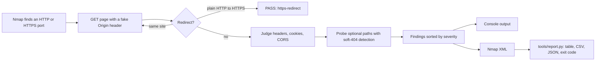

# http-hardening-check

[](https://github.com/VijaysinghPuwar/http-hardening-nmap-nse/actions/workflows/test.yml)


An Nmap script that audits the security headers, cookies and CORS policy of every web service in a scan. It checks the values, not just whether a header exists, and gives each finding a severity so results can gate a CI pipeline.

```
8443/tcp open  ssl/http nginx 1.18.0
| http-hardening-check:
|   url: https://localhost:8443/ (200)
|   result: FAIL (high=1 medium=6 low=6 info=1, fail-on=medium)
|   HIGH    cors-reflected-credentials     Origin reflected in Access-Control-Allow-Origin with credentials allowed
|   MEDIUM  cookie-no-secure               Cookie sent without Secure over HTTPS: session, tracker
|   MEDIUM  cookie-samesite-none-insecure  SameSite=None without Secure (rejected by browsers): tracker
|   MEDIUM  csp-broad-script-source        script-src allows any script from https:
|   MEDIUM  csp-unsafe-inline              script-src allows 'unsafe-inline' without a nonce or hash
|   MEDIUM  framing-allowed                X-Frame-Options ALLOW-FROM is ignored by current browsers; use CSP frame-ancestors
|   MEDIUM  hsts-disabled                  Strict-Transport-Security max-age=0 turns HSTS off
|   LOW     cookie-no-httponly             Cookie readable by JavaScript: session, tracker
|   LOW     csp-unsafe-eval                script-src allows 'unsafe-eval'
|   LOW     info-disclosure                Server: nginx/1.18.0
|   LOW     info-disclosure                X-Powered-By: PHP/8.1.2
|   LOW     referrer-policy-leaky          Referrer-Policy unsafe-url sends full URLs cross-origin
|   LOW     xcto-missing                   X-Content-Type-Options is not nosniff
|   INFO    xxp-enabled                    X-XSS-Protection enables the removed XSS auditor; set 0 or drop it
|   paths:
|     /admin      403  protected
|_    /.git/HEAD  200  absent (soft-404)
```

Every one of those headers is present. A presence-only check, such as Nmap's bundled `http-security-headers`, lists them and moves on.

## How it works



One request per page, one per probed path, and a few for soft-404 calibration when paths are given. No payloads are sent. Categories are `safe` and `discovery`.

## What it checks

| Area | Finding IDs | Severity |
|---|---|---|
| Transport | `no-https-redirect` | MEDIUM |
| HSTS | `hsts-missing`, `hsts-disabled` (max-age=0), `hsts-invalid` | MEDIUM |
| | `hsts-short-max-age` (below 182.5 days by default) | LOW |
| | `hsts-no-subdomains`, `hsts-over-http` (ignored by browsers) | INFO |
| CSP | `csp-missing`, `csp-no-script-restriction`, `csp-unsafe-inline` (without nonce or hash), `csp-broad-script-source` (`*`, `https:`, `data:`) | MEDIUM |
| | `csp-unsafe-eval`, `csp-report-only` | LOW |
| Clickjacking | `framing-missing`, `framing-allowed` (ALLOW-FROM, `frame-ancestors *`). CSP `frame-ancestors` alone passes. | MEDIUM |
| Cookies | `cookie-no-secure` (over HTTPS), `cookie-samesite-none-insecure` | MEDIUM |
| | `cookie-no-httponly` | LOW |
| CORS | `cors-reflected-credentials` | HIGH |
| | `cors-reflected-origin` | LOW |
| Other headers | `xcto-missing`, `referrer-policy-leaky`, `info-disclosure` (versions in Server, X-Powered-By, X-AspNet-Version) | LOW |
| | `referrer-policy-missing`, `xxp-enabled` | INFO |
| Exposure | `path-exposed` (2xx on a probed path that is not a soft-404) | MEDIUM |

Severities follow the [OWASP Secure Headers Project](https://owasp.org/www-project-secure-headers/) and [MDN](https://developer.mozilla.org/en-US/docs/Web/HTTP/Headers) guidance.

## Usage

Tested with Nmap 7.991. Use `-sV` so the script also runs on HTTP services on non-standard ports.

```bash
nmap -sV -p80,443 --script ./http-hardening-check.nse example.com
```

Virtual host over HTTPS, extra paths, XML for reporting:

```bash
nmap -sV -p443 --script ./http-hardening-check.nse \
  --script-args 'http-hardening-check.vhost=app.example.com,http-hardening-check.paths={/admin,/.git/HEAD,/server-status}' \
  -oX scan.xml 203.0.113.10
```

Lists use Nmap's brace syntax `{a,b}` or a quoted string `"a,b"`. An unquoted `a,b` is split by Nmap's argument parser and the script only receives `a`.

To install it system-wide:

```bash
sudo cp http-hardening-check.nse /usr/share/nmap/scripts/
sudo nmap --script-updatedb
nmap -sV -p443 --script http-hardening-check example.com
```

### Arguments

| Argument | Default | Description |
|---|---|---|
| `http-hardening-check.path` | `/` | Page to evaluate. Same-site redirects are followed. |
| `http-hardening-check.vhost` | target name | Hostname for the `Host` header and TLS SNI. |
| `http-hardening-check.paths` | none | Paths to probe for exposure. |
| `http-hardening-check.skip` | none | Finding IDs to suppress, for accepted risks. |
| `http-hardening-check.fail-on` | `medium` | Lowest severity that makes the result `FAIL`. |
| `http-hardening-check.hsts-min` | `15768000` | Minimum HSTS max-age in seconds. |
| `http-hardening-check.timeout` | `8000` | Per-request timeout in ms. |

## Reporting and CI

`tools/report.py` reads Nmap XML and prints a table, CSV or JSON. It exits `1` when a finding is at or above `--fail-on`, `0` when clean, and `2` when the file has no results from this script. Python standard library only.

```bash
python3 tools/report.py scan.xml                     # table
python3 tools/report.py scan.xml -f csv > findings.csv
python3 tools/report.py scan.xml --fail-on high      # gate a pipeline on HIGH only
```

```
127.0.0.1:8080   PASS
127.0.0.1:8443   HIGH    cors-reflected-credentials     Origin reflected in Access-Control-Allow-Origin with credentials allowed
127.0.0.1:8443   MEDIUM  cookie-no-secure               Cookie sent without Secure over HTTPS: session, tracker
...
127.0.0.1:8444   PASS
7 finding(s) at medium or above
```

## Test lab

`lab/server.py` starts six local targets, each built to trigger a known set of findings. It needs only Python and the `openssl` CLI.

| Port | Profile | Covers |
|---|---|---|
| 8080 | redirect | HTTP to HTTPS redirect passes |
| 8081 | bare | No headers, version in `Server`, open `/admin` |
| 8082 | legacy | HSTS over plain HTTP, CSP in Report-Only mode |
| 8443 | weak | Every header present with a bad value, CORS reflection, soft-404 |
| 8444 | hardened | Passes only when SNI is `app.lab.test`; HEAD returns 405 |
| 8445 | partial | Short HSTS, CSP without script rules, `frame-ancestors *` |

```bash
python3 lab/server.py                                # run the targets
python3 -m unittest -v tests/test_lab.py             # 11 end-to-end tests, about 45 s
```

The tests run the real Nmap binary against the lab and assert the exact set of finding IDs per port. CI runs them on every push with Ubuntu 24.04's Nmap package.

## Limitations

- One page per port. It does not crawl, so headers set only on some routes are not seen.
- CSP is judged on script sources and `frame-ancestors`. Other directives such as `object-src` and `base-uri` are not graded.
- A plain HTTP port that redirects to HTTPS is not header-checked; the HTTPS port is.
- Redirects to another host or port are not followed. The redirect response itself is judged and the output says so.
- Soft-404 detection uses Nmap's `http.identify_404`, which can be fooled by pages that change on every request.

## License

Same as Nmap. See the [Nmap license](https://nmap.org/book/man-legal.html).
